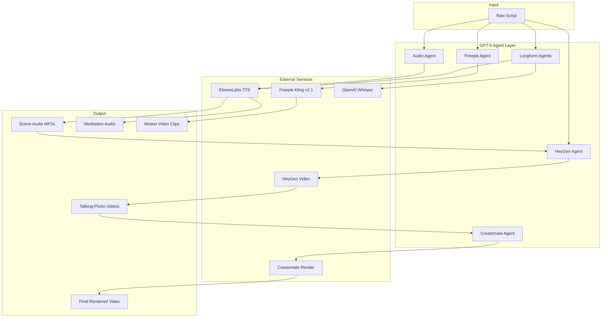
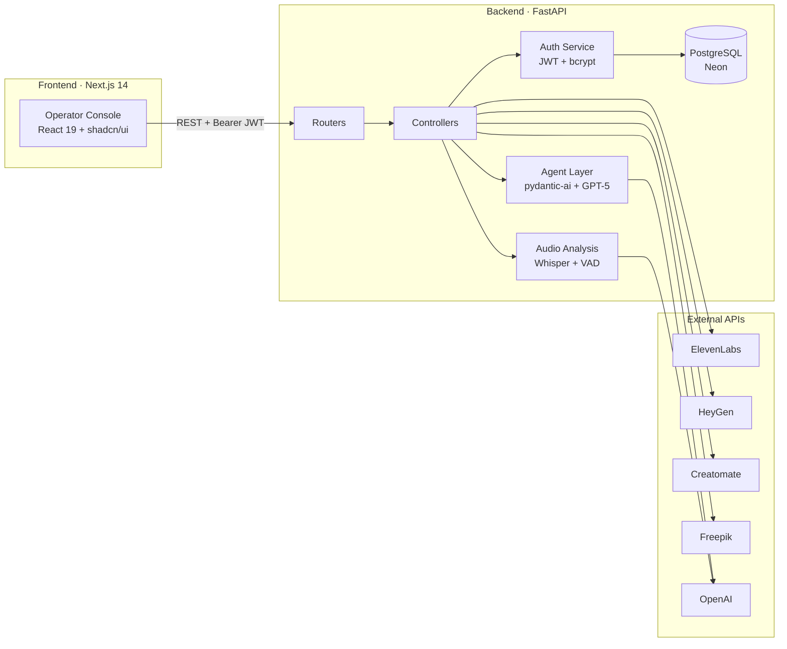
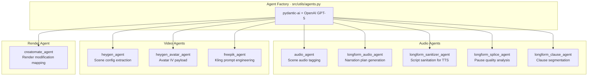
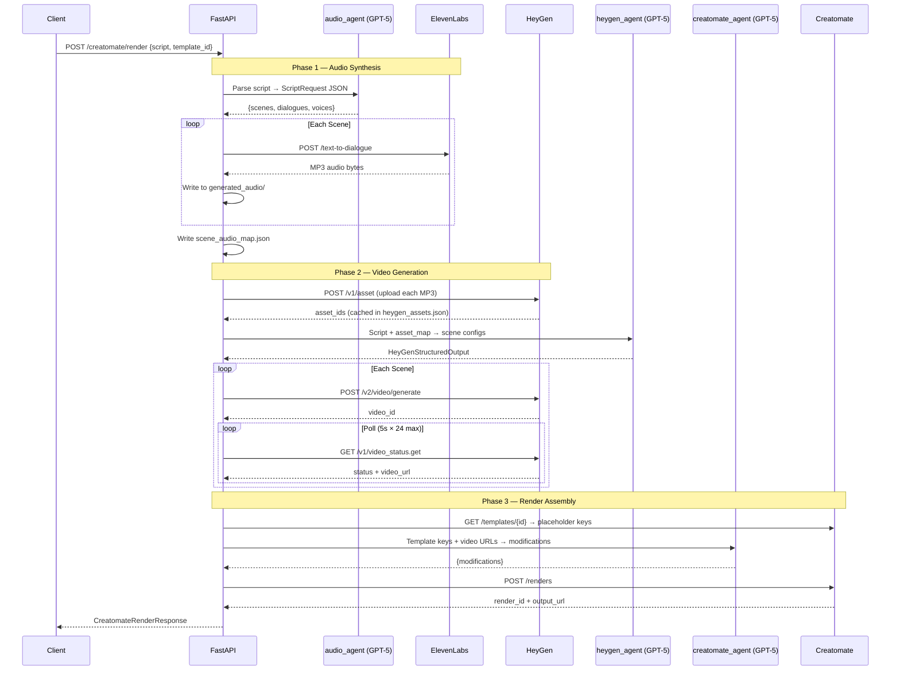
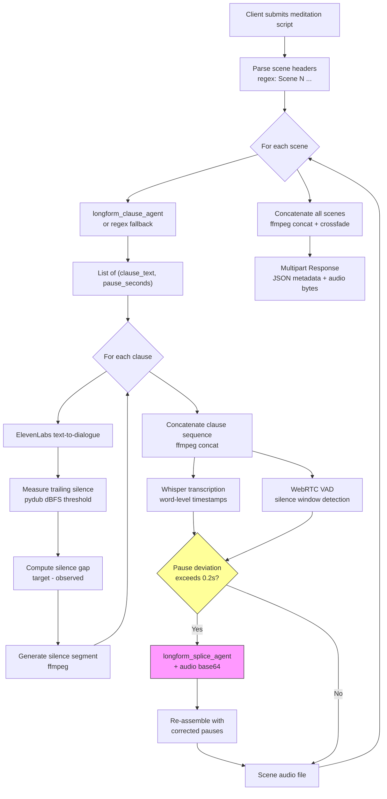
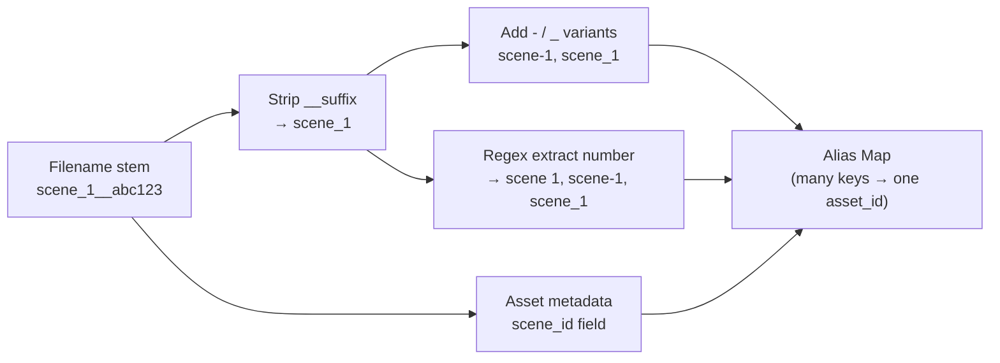
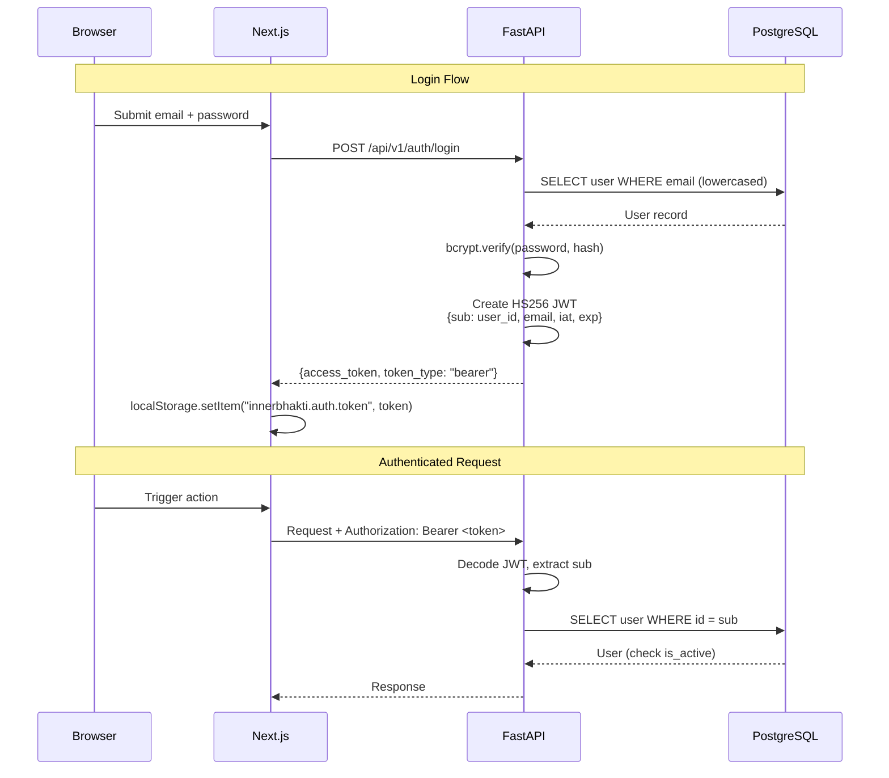
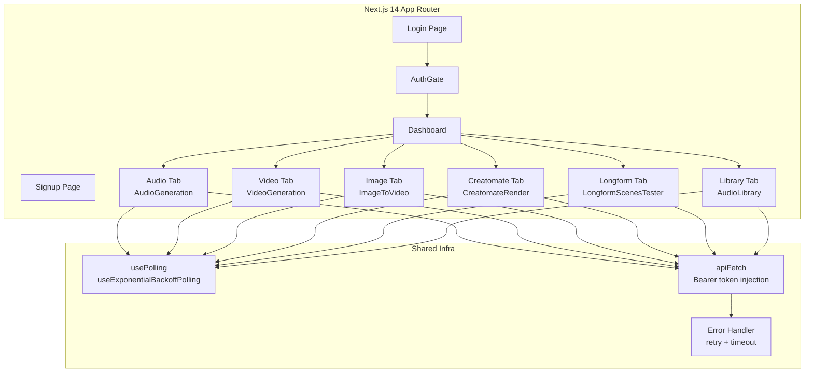
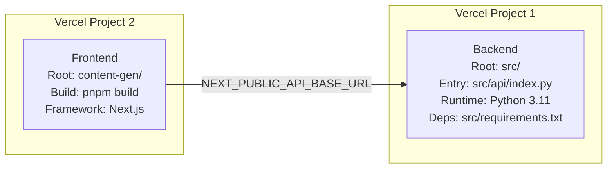

# Luma

AI-powered video content production platform. Transforms scripts into production-ready video content with talking avatars, expressive audio, and intelligent scene management.

## Overview

Luma automates the full video production pipeline — from raw script to final rendered video. It orchestrates multiple AI services through specialized GPT-5 agents, each responsible for a stage of production.



### Capabilities

| Capability | Description | Services Used |
|---|---|---|
| **Script-to-Audio** | Per-scene dialogue synthesis with emotion tags and multi-character support | GPT-5 + ElevenLabs |
| **Script-to-Video** | Synchronized talking-photo avatar videos | GPT-5 + HeyGen |
| **Full Pipeline Render** | End-to-end: script → audio → video → composited render | GPT-5 + ElevenLabs + HeyGen + Creatomate |
| **Longform Meditation Audio** | Clause-level TTS with silence analysis, VAD, and AI-driven pause correction | GPT-5 + ElevenLabs + Whisper + WebRTC VAD |
| **Image-to-Video** | Static images transformed into cinematic motion clips | GPT-5 + Freepik Kling v2.1 |
| **Operator Console** | Web dashboard for managing all workflows with real-time status | Next.js 14 |

## Architecture



### Project Structure

```
Luma/
├── src/                              # FastAPI backend (Python 3.11+)
│   ├── main.py                       # App entry, lifespan, CORS, static mounts
│   ├── api/
│   │   ├── index.py                  # Vercel ASGI shim
│   │   └── v1/
│   │       ├── api.py                # Master router, auth dependency injection
│   │       └── routers/              # Domain routers (auth, elevenlabs, heygen, etc.)
│   ├── controllers/                  # Business logic + external API orchestration
│   │   ├── elevenlabs.py             # Audio synthesis (1087 lines, most complex)
│   │   ├── heygen.py                 # HeyGen video generation + asset matching
│   │   ├── creatomate.py             # Full pipeline orchestration
│   │   ├── freepik.py                # Kling image-to-video
│   │   ├── generate_video.py         # HeyGen audio upload + caching
│   │   └── longform_scenes.py        # Meditation audio pipeline
│   ├── models/                       # Pydantic v2 request/response schemas
│   ├── services/auth.py              # bcrypt hashing, HS256 JWT, user auth
│   ├── db/                           # SQLAlchemy async ORM (asyncpg)
│   │   ├── session.py                # Engine, session factory, init_models()
│   │   └── models.py                 # User ORM model
│   ├── utils/
│   │   ├── agents.py                 # 9 GPT-5 agent definitions (pydantic-ai)
│   │   └── audio_analysis.py         # Whisper transcription + WebRTC VAD
│   ├── prompts/                      # LLM system prompts (markdown)
│   └── config/config.py              # Pydantic settings from .env
├── content-gen/                      # Next.js 14 operator console
│   ├── app/                          # App Router pages (dashboard, login, signup)
│   ├── components/                   # React components + shadcn/ui
│   ├── hooks/                        # usePolling, useExponentialBackoffPolling
│   └── lib/                          # API client, error handling, utilities
├── tests/                            # pytest unit tests
├── pyproject.toml                    # Python deps & tooling config
└── .env.example                      # Environment variable template
```

### GPT-5 Agent System

Nine specialized agents are instantiated at startup via `pydantic-ai`, each with a dedicated system prompt loaded from `src/prompts/`:



All agents output strict JSON conforming to Pydantic schemas. Every agent call has a fallback path — if the agent fails or returns invalid JSON, heuristic defaults are used instead of failing the request.

## Core Pipelines

### Standard Video Production

`POST /api/v1/creatomate/render` — Full end-to-end pipeline:



### Longform Meditation Audio

`POST /api/v1/longform_scenes` — Clause-level TTS with closed-loop pause correction:



**Pause defaults:** comma → 0.5s, sentence-ending marks (`.` `?` `!` `।`) → 1.5s

**Splice correction threshold:** 0.2s deviation triggers the `longform_splice_agent`, which receives up to 750 KB of base64-encoded audio for context-aware pause adjustment.

### HeyGen Asset Matching

The `_build_asset_lookup()` algorithm creates a flexible many-to-one alias map for matching script references to uploaded audio assets:



## Authentication



- **JWT expiry:** configurable, default 60 minutes (range: 5–1440)
- **No self-registration:** users are provisioned directly in PostgreSQL by an administrator
- **Cross-tab logout:** frontend `AuthGate` listens to `storage` events for token removal

## Frontend

### Operator Console



**Tech:** React 19, Tailwind CSS v4, shadcn/ui (Radix primitives), Framer Motion, Zod, react-hook-form

### Polling Hooks

| Hook | Strategy | Default Interval | Use Case |
|---|---|---|---|
| `usePolling` | Fixed interval | 5000ms | HeyGen video status |
| `useExponentialBackoffPolling` | Exponential backoff | Configurable base/max | Long-running tasks |

Both hooks auto-cleanup on unmount and support `maxAttempts`.

## API Reference

All endpoints under `/api/v1`. All except `/auth/login` require `Authorization: Bearer <token>`.

### Authentication
| Method | Path | Description |
|---|---|---|
| POST | `/auth/login` | Login → JWT |

### Audio (ElevenLabs)
| Method | Path | Description |
|---|---|---|
| POST | `/elevenlabs/generate-audio` | Per-scene audio from script |
| POST | `/elevenlabs/generate-audio/longform` | Longform narration with clause-level synthesis and pause correction |
| GET | `/elevenlabs/audio-files` | List generated files + manifests |
| DELETE | `/elevenlabs/audio-files` | Clear cached audio |

### Video (HeyGen)
| Method | Path | Description |
|---|---|---|
| POST | `/heygen/generate-video` | Talking-photo videos from script |
| POST | `/heygen/upload-audio-assets` | Upload audio to HeyGen (cached) |
| POST | `/heygen/avatar-iv/generate` | Avatar IV video generation |

### Image-to-Video (Freepik Kling v2.1)
| Method | Path | Description |
|---|---|---|
| POST | `/freepik/image-to-video/kling-v2-1-std` | Submit Kling video task |
| GET | `/freepik/image-to-video/kling-v2-1/{task_id}` | Poll status or stream download |

### Rendering (Creatomate)
| Method | Path | Description |
|---|---|---|
| POST | `/creatomate/render` | Full pipeline: script → audio → video → render |
| POST | `/creatomate/upload-image` | Upload scene image |

### Longform Scenes
| Method | Path | Description |
|---|---|---|
| POST | `/longform_scenes` | Multi-scene meditation audio (multipart response) |

### System
| Method | Path | Description |
|---|---|---|
| GET | `/health` | Health check |
| GET | `/` | Root status |

## Script Format

```
[Scene 1 – Introduction]
Visual: Professional setting
Dialogue (VO): "Welcome to our platform"
Talking photo: Monica_inSleeveless_20220819

[Scene 2 – Main Content]
Dialogue (VO): "Here's what we offer"
```

- Scene headers follow `[Scene N ...]` format (parsed via regex)
- `Talking photo:` sets the HeyGen avatar ID
- `Dialogue (VO):` is synthesized by ElevenLabs
- Audio assets are matched to scenes automatically via the alias map

## Tech Stack

### Backend

| Technology | Purpose |
|---|---|
| FastAPI | Web framework with async support |
| Pydantic v2 | Request/response validation, settings |
| Pydantic AI | GPT-5 agent orchestration framework |
| SQLAlchemy (async) + asyncpg | PostgreSQL ORM |
| bcrypt + python-jose | Password hashing + HS256 JWT |
| ElevenLabs SDK | Text-to-speech synthesis |
| pydub + webrtcvad | Audio manipulation + voice activity detection |
| ffmpeg (system) | Audio stitching, concat, loudnorm, crossfade |
| requests | HTTP client for external APIs |
| ruff | Linting + formatting |

### Frontend

| Technology | Purpose |
|---|---|
| Next.js 14 | App Router framework |
| React 19 | UI library |
| TypeScript 5 | Type safety |
| Tailwind CSS v4 | Styling |
| shadcn/ui + Radix UI | Component primitives |
| Framer Motion | Animations |
| Zod + react-hook-form | Validation + form state |

### Infrastructure

| Technology | Purpose |
|---|---|
| PostgreSQL (Neon) | User database |
| Vercel | Deployment (two projects) |
| Docker | Containerized deployment |
| uv | Python package management |
| pnpm | Node.js package management |

## Getting Started

### Prerequisites

- Python 3.11+ with [uv](https://github.com/astral-sh/uv)
- Node.js 18+ with pnpm
- ffmpeg installed and on PATH
- API keys: OpenAI, ElevenLabs, HeyGen (see `.env.example`)

### Setup

```bash
# Clone and install backend
git clone https://github.com/AbhiramVSA/Luma.git
cd Luma
cp .env.example .env  # Fill in your API keys
uv sync

# Install frontend
cd content-gen
pnpm install
cd ..
```

### Run Locally

```bash
# Backend (terminal 1)
uv run fastapi dev src/main.py

# Frontend (terminal 2)
cd content-gen
pnpm dev
```

- Backend API: http://127.0.0.1:8002 (Swagger docs at `/docs`)
- Frontend: http://127.0.0.1:3000

### Environment Variables

See [`.env.example`](.env.example) for the full list. Key variables:

| Variable | Required | Description |
|---|---|---|
| `OPENAI_API_KEY` | Yes | GPT-5 agent orchestration + Whisper |
| `ELEVENLABS_API_KEY` | Yes | Text-to-speech synthesis |
| `HEYGEN_API_KEY` | Yes (video) | Talking-photo video generation |
| `DATABASE_URL` | Yes | PostgreSQL connection string |
| `JWT_SECRET_KEY` | Yes | HS256 token signing secret |
| `FREEPIK_API_KEY` | Optional | Image-to-video via Kling v2.1 |
| `CREATOMATE_API_KEY` | Optional | Video render assembly |

## Deployment

### Vercel (Two Projects)



### Docker

```bash
docker build -t luma .
docker run -d -p 8002:8002 --env-file .env -v $(pwd)/generated_audio:/app/generated_audio luma
```

## Development

```bash
# Lint and format
uv run ruff check src
uv run ruff format src

# Run tests
uv run pytest

# Frontend
cd content-gen
pnpm lint
pnpm build
```

### Testing

Tests use pytest + pytest-asyncio. All current tests cover pure functions with no external dependencies (no mocking needed):

| Test File | Coverage |
|---|---|
| `test_config.py` | `Settings.allowed_origins` property |
| `test_models.py` | Pydantic model validation for all request/response schemas |
| `test_elevenlabs_helpers.py` | Clause splitting, text sanitization, pause defaults |
| `test_heygen_helpers.py` | Asset lookup, scene ID resolution, talking-photo normalization |

### Runtime File System

The backend creates these directories at runtime:

```
generated_audio/
├── scene_1__<uuid8>.mp3              # Per-scene audio clips
├── scene_audio_map.json              # Maps file_name → scene_id
├── heygen_assets.json                # Cached HeyGen asset_id lookups
├── longform_manifest_<uuid8>.json    # Longform run manifests
└── longform_<segment>__<uuid8>.mp3   # Longform segment files

generated_assets/
└── images/
    └── <scene_id>_<hex8>.<ext>       # Uploaded scene images
```

Both directories are mounted as FastAPI `StaticFiles` and served directly.

## License

Proprietary — Internal use only.
